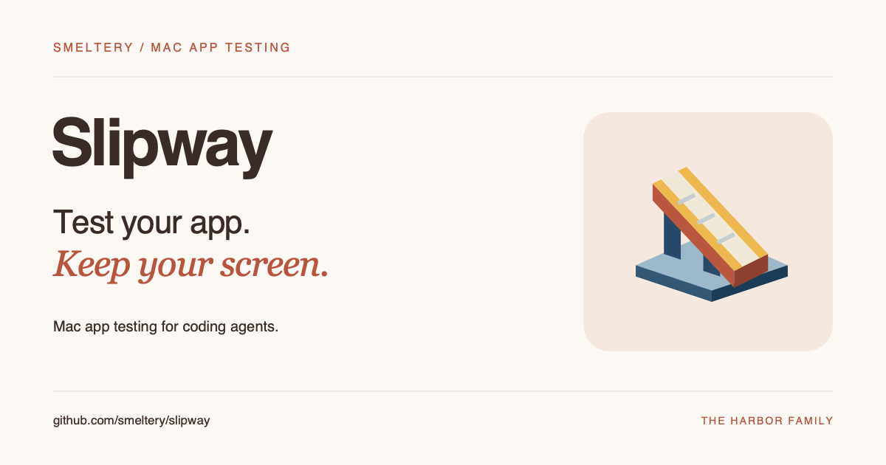

#  Slipway



[](https://github.com/smeltery/slipway/actions/workflows/ci.yml)
[](https://github.com/smeltery/slipway/releases)
[](docs/development.md)
[](package.json)
[](.flox/env/manifest.toml)
[](LICENSE)

Slipway sends Mac app builds to a headless Tart VM, then launches, screenshots and drives them over SSH. Porthole makes that activity visible.

```sh
slipway setup
slipway note "Checking the new search field"
slipway open build/MyApp.app
slipway ui MyApp
slipway shot MyApp
```

[Install and start](docs/getting-started.md) · [Documentation](docs/README.md) ·
[Releases](https://github.com/smeltery/slipway/releases)

Requires macOS for app testing. Local Tart VMs require Apple silicon; an existing
remote Mac can also be used. See [requirements](docs/getting-started.md).

Licensed under [PolyForm Shield 1.0.0](LICENSE). Upstream MIT notices
are preserved in [provenance](docs/provenance.md).
