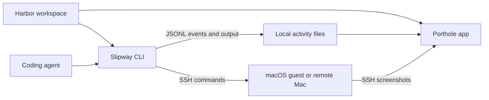
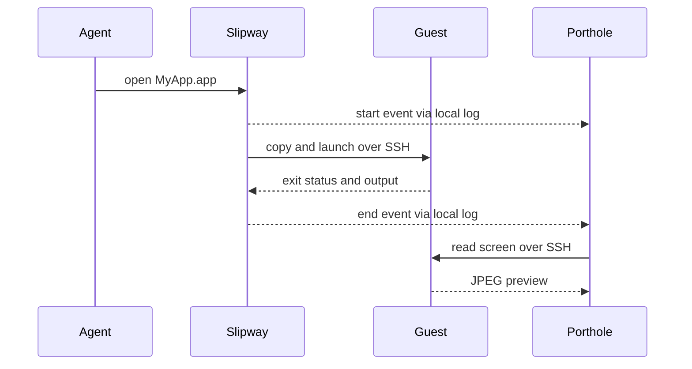

# Architecture

Harbor assembles repositories without owning their releases. Slipway runs
commands and records activity. Porthole reads that history and observes the
same target. Both use the same SSH key, target configuration and ControlPath.

## Activity contract

Each run starts with a version-1 JSON line containing `event`, `id`, `time`,
`pid`, `command`, `args`, `cwd`, `agent`, `session` and `target`. Optional fields
include `transcript` and AppleScript `input`. Its end event uses the same `id`,
an exit `status` and the last output line. Full output is in `runs/<id>.txt`.

Porthole tolerates partial lines, log rotation and interrupted commands.
New fields must be optional and existing field meanings stable. Slipway rotates
activity after roughly 20 MB and removes output older than 30 days during rotation.
An unfinished run is live only while its process exists, for at most 30 minutes.

Local VM host keys are not persisted because addresses are reused. Remote Macs
use `StrictHostKeyChecking=accept-new`. Keep target-specific SSH policy aligned
in both repositories. See [configuration](configuration.md) for paths and privacy.
